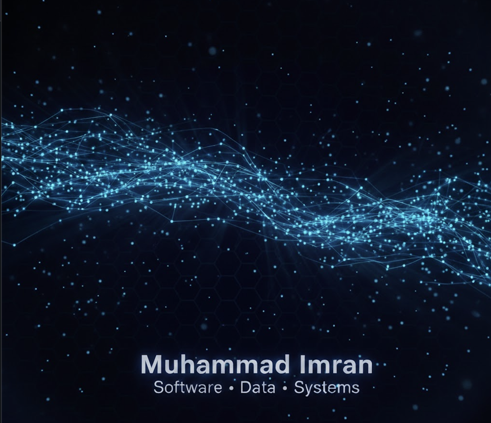

  

Hi, I'm Muhammad Imran. Software Engineer and May 2026 Computer Science graduate (Farmingdale State College, SUNY), minor in applied mathematics.

I build production systems in Java, Python, FastAPI, and React, and I don't stop until they work. Currently a Software Support Technician at BRdata, and a Linux Foundation LFX Mentee contributing production Java to the Zowe Client Java SDK, which powers IBM z/OS mainframe access for financial, healthcare, and government systems.

---

## 🧠 About Me

Software Engineer, CS Grad 2026, Farmingdale State College (SUNY).
"I build full-stack Java applications, FastAPI and React web apps, Android apps, and applied machine-learning projects."

---

## 🚀 Featured Projects

### 🖥️ Zowe Client Java SDK — Linux Foundation LFX Mentee

Java | Maven | IBM z/OS | May 2026 – Present

Selected from a global applicant pool for the Linux Foundation LFX Mentorship. Implementing 11 production-grade Java methods across the complete z/OSMF Workflow REST API lifecycle, giving enterprise developers a modern Java and Maven interface to automate mainframe operations at scale for IBM z/OS systems used by financial, healthcare, and government institutions. Merged pull requests:
- [Add zosmfworkflow package with archived workflow DELETE and LIST APIs](https://github.com/zowe/zowe-client-java-sdk/pull/514)
- [Add z/OSMF create/update system variables API method](https://github.com/zowe/zowe-client-java-sdk/pull/531)
- [Fix WorkflowArchive.archive() NullPointerException on missing request body](https://github.com/zowe/zowe-client-java-sdk/pull/560)

---

### 👕 FitGPT — AI Wardrobe Assistant

FastAPI | React | PostgreSQL | Android (Kotlin) | Feb 2026 – May 2026

Led backend development in an Agile team. Architected a FastAPI and PostgreSQL service with JWT auth, Google OAuth, and weather-driven outfit recommendations for 175+ wardrobe items. Delivered 12+ features across 3 sprints, backed by 185+ backend tests, 617 web tests, and a full GitHub Actions CI/CD pipeline. Live at fitgpt.tech.

---

### ☀️ SolarShare — Solar Energy Marketplace

FastAPI | Next.js | TypeScript | Jan 2025 – Present

Co-founder and full-stack developer. Architected a solar energy marketplace with payment rails, 3-role RBAC, and a 4-stage billing lifecycle for real-time consumer-to-solar-farm energy transactions. Built a financial modeling engine with 12-month seasonal savings projections, rollover logic, and automated utility rate refresh across 3+ NY regions. 1st place, 2025 PSEG Long Island Innovation Challenge. Competed at the 2026 Hult Prize USA East against 44 university teams.

---

### 📈 MarketForecastAI — Retail Stock Forecasting

Python | Time Series | Machine Learning | Jun 2025 – Aug 2025

Implemented Prophet and ARIMA models on 3+ years of real market data (AMZN, COST), achieving a 15% accuracy gain over baseline. AI4ALL Ignite certified, demoed to 50+ mentors and 100+ users at the AI4ALL Ignite showcase.

---

### 📱 CodeSensei — Kotlin Code Learning Companion

Kotlin | Android | MVVM

Android app that helps beginners understand Kotlin code, analyzes errors, and explains structure issues, with history tracking and a polished multi-screen UI.

---

### 💳 FinTrack — Personal Finance Management App

Java | Spring Boot | JavaFX | MySQL (Azure)

Team project. I led backend development with Spring Boot and also contributed to the JavaFX frontend. Full-stack finance application with secure authentication, budget tracking, transaction management, and savings goals, backed by an Azure-hosted MySQL database.

---

## 🛠️ Tech Focus

Languages: Java, Python, TypeScript, JavaScript, Kotlin, SQL
Frameworks: FastAPI, React, Next.js, Spring Boot, Jetpack Compose
AI/ML: Groq API (Llama 3.1), Prophet, ARIMA
Tools: Git, GitHub Actions, Docker, PostgreSQL, MySQL, Firebase

## 📫 Contact

Email: imranabdullah926@gmail.com
Portfolio: https://muhammad7839.github.io/portfolio
LinkedIn: https://www.linkedin.com/in/muhammadimran-swe/
