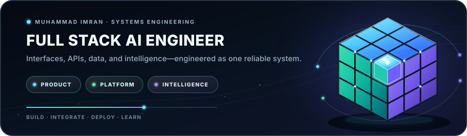

# Muhammad Imran

  

Full Stack AI Engineer building production systems across web applications, APIs, data, mobile, and AI workflows.

I am a May 2026 Computer Science graduate from Farmingdale State College with a minor in Applied Mathematics. I contribute production Java to the Zowe Client Java SDK through Linux Foundation LFX, work as a Software Support Technician at BRdata, and build full stack products with measurable tests, live deployments, and clear technical ownership.

Open to Full Stack AI Engineer opportunities.

## Selected Engineering Work

### [FitGPT](https://github.com/Muhammad7839/FitGPT): AI Wardrobe Assistant

`FastAPI` `React` `PostgreSQL` `Kotlin` `Groq API` `GitHub Actions`

Led backend development for a cross platform AI wardrobe platform with JWT authentication, Google OAuth, live weather, wardrobe management, and personalized outfit recommendations. Delivered 12+ features across three Agile sprints, supported by 185+ backend tests, 617 web tests, and automated CI.

[Live product](https://fitgpt.tech) · [Source code](https://github.com/Muhammad7839/FitGPT)

### AURA Forge: Agentic Engineering Paved Road

`Agent workflows` `Evaluation` `Policy gates` `CI` `ADRs` `Operations`

Completed the final LaunchCode Agentic Engineering capstone by turning FitGPT's AURA workflow into a repeatable engineering paved road. The work includes repository scoped instructions, deterministic evaluation gates, traceable CI evidence, architecture decisions, an operations runbook, stakeholder documentation, and a reproducible submission package.

Repository access is private because this was completed inside an authorized course workspace.

### [Zowe Client Java SDK](https://github.com/Muhammad7839/zowe-client-java-sdk): Linux Foundation LFX

`Java` `Maven` `REST APIs` `IBM z/OS`

Selected as a Linux Foundation LFX Mentee to extend the z/OSMF Workflow REST API lifecycle in the open source Zowe Java SDK. Working across 11 production Java methods for enterprise mainframe automation.

Verified merged pull requests:

1. [Archived workflow DELETE and LIST APIs](https://github.com/zowe/zowe-client-java-sdk/pull/514)
2. [Create and update system variables API](https://github.com/zowe/zowe-client-java-sdk/pull/531)
3. [Fix WorkflowArchive null request body failure](https://github.com/zowe/zowe-client-java-sdk/pull/560)

### [SolarShare](https://github.com/Muhammad7839/SolarShare): Solar Energy Marketplace

`FastAPI` `Next.js` `TypeScript` `Role based access` `Financial modeling`

Co-founded and built a solar energy marketplace with payment rails, three user roles, a four stage billing lifecycle, and auditable 12 month savings projections across New York utility regions. Won first place at the 2025 PSEG Long Island Innovation Challenge.

[Source code](https://github.com/Muhammad7839/SolarShare)

### [StockVision](https://github.com/Muhammad7839/MarketForecastAI): AI Stock Forecasting

`Python` `Prophet` `ARIMA` `Time series` `React`

Built through AI4ALL Ignite using more than three years of AMZN and COST market data. Compared Prophet and ARIMA forecasts with MAE and RMSE, documented model behavior, and presented the results through visualizations.

[Source code and results](https://github.com/Muhammad7839/MarketForecastAI)

### [CodeSensei](https://github.com/Muhammad7839/CodeSensei): Kotlin Learning Companion

`Kotlin` `Android` `MVVM` `Local persistence`

Built an Android learning companion that explains common Kotlin structure and syntax problems for beginners. Includes detailed issue views, saved analysis history, appearance settings, progress levels, and a multi screen interface.

[Source code](https://github.com/Muhammad7839/CodeSensei) · [Video demo](https://youtu.be/Di1P4Hz05n4)

### [FinTrack](https://github.com/Muhammad7839/FinTrack): Personal Finance Platform

`Java` `Spring Boot` `JavaFX` `MySQL` `Azure`

Led backend development for a team finance application. Built Spring Boot services for authentication, budgets, transactions, and savings goals, then integrated them with a JavaFX client and an Azure hosted MySQL database.

[Source code](https://github.com/Muhammad7839/FinTrack) · [Video demo](https://youtu.be/d7Ji9XbgX3I)

## Technical Focus

* Languages: Java, Python, TypeScript, JavaScript, Kotlin, SQL
* Full stack: FastAPI, React, Next.js, Spring Boot, Jetpack Compose
* AI and ML: agent workflows, Groq and Llama 3.1, Prophet, ARIMA, TensorFlow.js, MobileNet
* Data and delivery: PostgreSQL, MySQL, Firebase, Docker, GitHub Actions, Vercel, Render

## Contact

* [Portfolio](https://muhammad7839.github.io/portfolio)
* [LinkedIn](https://www.linkedin.com/in/muhammadimran-swe/)
* Email: imranabdullah926@gmail.com
